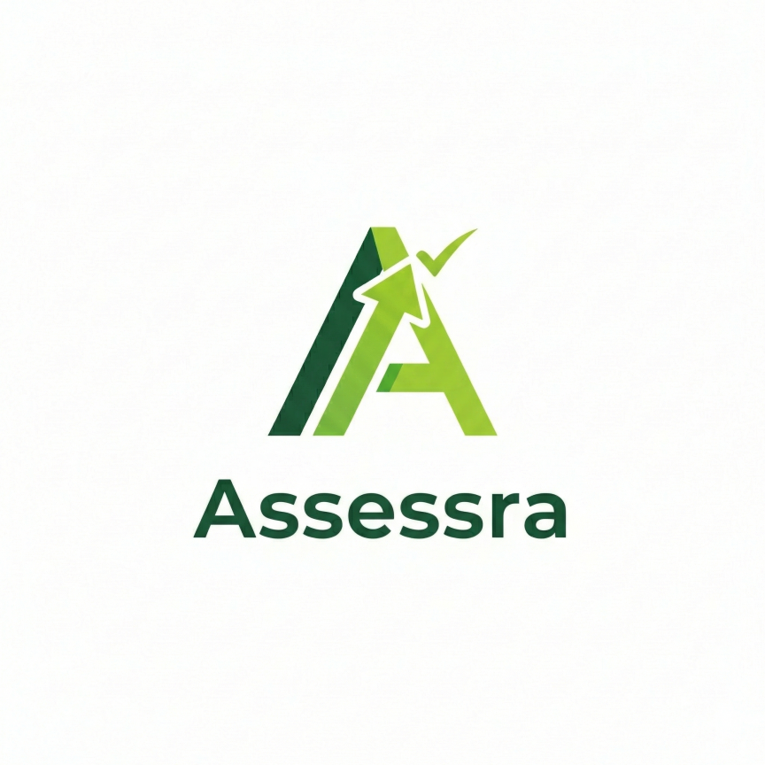

<p align="center">
  
</p>

<h1 align="center">Assessra</h1>

<p align="center">
  <strong>AI-Powered Past Paper & Exam Preparation Platform for AS & A Level Students</strong>
</p>

<p align="center">
  <a href="https://assessra-v2.vercel.app">🌐 Live Site</a> •
  <a href="#features">✨ Features</a> •
  <a href="#tech-stack">🛠 Tech Stack</a> •
  <a href="#getting-started">🚀 Getting Started</a> •
  <a href="#team">👥 Team</a>
</p>

<p align="center">
  
  
  
  
  
  
</p>

---

## 📖 About

**Assessra** is an intelligent exam preparation platform built for **Cambridge AS & A Level** students. It combines real past papers with cutting-edge AI to provide instant, examiner-grade feedback on student answers — making high-quality exam practice accessible anytime, anywhere.

The platform currently supports **Business (9609)**, **Economics (9708)**, and **General Paper (8021)**, with plans to expand to more subjects.

> _"Like having a personal Cambridge examiner available 24/7."_

---

## ✨ Features

### 🤖 AI Practice Mode
Generate unlimited practice questions across any subject and topic. The AI acts as a Cambridge examiner — marking your answer, awarding marks point-by-point, delivering detailed feedback, a model answer, and an examiner tip. Uses **dynamic model routing** to select more powerful models (GPT-4o) for calculation-heavy questions.

### 📄 Past Papers with AI Marking
Browse and attempt authentic Cambridge past papers organized by **year**, **season** (Feb/Mar, May/Jun, Oct/Nov), and **variant**. Write your answers in a split-screen view and receive instant AI-powered marking against the official marking scheme, powered by **Retrieval-Augmented Generation (RAG)**.

### 📊 Scorecard & Progress Tracking
Track every paper attempt with persistent scorecards. View your scores per paper, monitor daily progress against a configurable target, and watch your cumulative XP grow over time.

### 🏆 Leaderboard
Compete with fellow students on a live leaderboard ranked by total XP. See where you stand and stay motivated with daily streak tracking.

### 📚 Vocabulary Builder
Expand your academic vocabulary with curated word sets. Track mastery and revisit words you find challenging.

### 💬 Idioms Collection
Build fluency with a rich collection of idioms — particularly useful for General Paper and English-based assessments.

### 📐 Definitions & Formulae
Quick-reference panels for key subject definitions and formulae, so you spend less time searching and more time practising.

### 📖 Daily Short Story
A curated short story delivered fresh each day from classic and contemporary literature — designed to enrich vocabulary, comprehension, and a love for reading.

### 🛡️ Admin Panel
A protected admin interface for managing the platform — including PDF ingestion for marking schemes and question papers, and monitoring embedded document chunks.

---

## 🛠 Tech Stack

### Frontend
| Technology | Purpose |
|---|---|
| **Next.js 16** (App Router) | Full-stack React framework with server-side rendering & API routes |
| **React 19** | UI library with latest features (Server Components, Suspense) |
| **Tailwind CSS 4** | Utility-first CSS framework for responsive, modern UI |
| **Plus Jakarta Sans & Playfair Display** | Premium typography via Google Fonts |
| **Material Symbols** | Icon system from Google |

### Backend & Database
| Technology | Purpose |
|---|---|
| **Next.js API Routes** | Serverless backend endpoints |
| **Supabase (PostgreSQL)** | Primary database for users, scores, document chunks, and leaderboard |
| **Supabase pgvector** | Vector similarity search for RAG retrieval |
| **NextAuth.js v4** | Authentication with Google OAuth |
| **bcrypt.js** | Password hashing for admin access |

### AI & Machine Learning
| Technology | Purpose |
|---|---|
| **OpenAI GPT-4o / GPT-4o-mini** | Primary LLM for answer evaluation, question generation, and feedback |
| **Anthropic Claude (Haiku 4.5)** | Alternative LLM provider (switchable via env config) |
| **OpenAI text-embedding-ada-002** | 1536-dimensional embeddings for document vectorisation |
| **LangChain** | Orchestration layer for LLM workflows |
| **RAG Pipeline** | Custom Retrieval-Augmented Generation — PDF → chunks → embeddings → similarity search → context-enriched prompting |

### PDF Processing
| Technology | Purpose |
|---|---|
| **unpdf** | Serverless-compatible PDF text extraction |
| **pdf-parse** | PDF parsing utilities |
| **pdfjs-dist** | Client-side PDF rendering |

### Deployment & Infrastructure
| Technology | Purpose |
|---|---|
| **Vercel** | Hosting, CI/CD, and edge functions |
| **Render** | Backend API services |

---

## 🧠 How It Works

```
┌─────────────┐     ┌──────────────┐     ┌──────────────────┐
│  Student     │────▶│  Next.js     │────▶│  Supabase        │
│  Browser     │     │  App Router  │     │  (PostgreSQL +   │
│              │◀────│  + API Routes│◀────│   pgvector)      │
└─────────────┘     └──────┬───────┘     └──────────────────┘
                           │
                    ┌──────▼───────┐
                    │   AI Engine  │
                    │ ┌──────────┐ │
                    │ │ OpenAI   │ │
                    │ │ GPT-4o   │ │
                    │ └──────────┘ │
                    │ ┌──────────┐ │
                    │ │ RAG      │ │
                    │ │ Pipeline │ │
                    │ └──────────┘ │
                    └──────────────┘
```

1. **PDF Ingestion** — Admin uploads marking schemes & question papers → extracted text is split into overlapping chunks → each chunk is embedded into a 1536-d vector via OpenAI → stored in Supabase with pgvector.

2. **Student Answers** — When a student submits an answer, the system retrieves the most relevant marking scheme chunks via cosine similarity search (RAG).

3. **AI Evaluation** — The retrieved context + student answer + examiner system prompt are sent to the LLM, which returns structured feedback: marks, breakdown, feedback, model answer, and examiner tips.

4. **Smart Model Routing** — For calculation-heavy subjects (Economics, Maths), the system automatically routes to GPT-4o with Chain-of-Thought prompting to ensure mathematical accuracy.

---

## 🚀 Getting Started

### Prerequisites
- **Node.js** 18+
- **npm** or **yarn**
- A **Supabase** project with pgvector enabled
- **OpenAI API Key** (and optionally an **Anthropic API Key**)

### Installation

```bash
# Clone the repository
git clone https://github.com/iamrehhh/Assessra-v2.git
cd Assessra-v2

# Install dependencies
npm install

# Set up environment variables
cp .env.example .env.local
# Edit .env.local with your API keys and database credentials
```

### Environment Variables

| Variable | Description |
|---|---|
| `OPENAI_API_KEY` | OpenAI API key for GPT & embeddings |
| `ANTHROPIC_API_KEY` | Anthropic API key (optional, for Claude) |
| `LLM_PROVIDER` | `openai` or `claude` |
| `NEXTAUTH_URL` | Your app URL (e.g., `http://localhost:3000`) |
| `NEXTAUTH_SECRET` | Random secret for NextAuth session encryption |
| `GOOGLE_CLIENT_ID` | Google OAuth client ID |
| `GOOGLE_CLIENT_SECRET` | Google OAuth client secret |
| `NEXT_PUBLIC_SUPABASE_URL` | Supabase project URL |
| `NEXT_PUBLIC_SUPABASE_ANON_KEY` | Supabase anonymous key |
| `ADMIN_SECRET` | Secret key for admin panel access |

### Run Development Server

```bash
npm run dev
```

Open [http://localhost:3000](http://localhost:3000) to access the application.

---

## 📁 Project Structure

```
Assessra-v2/
├── app/                    # Next.js App Router
│   ├── api/                # API routes (18 endpoints)
│   │   ├── ai/             # AI chat endpoint
│   │   ├── evaluate-answer/ # Answer evaluation with RAG
│   │   ├── generate-question/ # AI question generation
│   │   ├── mark/           # Past paper marking
│   │   ├── past-papers/    # Past paper data endpoints
│   │   ├── leaderboard/    # Leaderboard API
│   │   ├── scores/         # Score tracking
│   │   └── ...             # More endpoints
│   ├── past-papers/        # Past papers page route
│   ├── layout.js           # Root layout with providers
│   └── page.js             # Entry point
├── components/             # React components
│   ├── views/              # Main application views (15 views)
│   │   ├── HomeView.js     # Dashboard with stats & daily story
│   │   ├── PracticeView.js # AI practice mode
│   │   ├── PastPapersView.js # Past papers browser
│   │   ├── LeaderboardView.js
│   │   ├── VocabView.js
│   │   └── ...
│   ├── Dashboard.js        # Main dashboard controller
│   ├── Sidebar.js          # Navigation sidebar
│   └── LoginPage.js        # Authentication page
├── lib/                    # Utility libraries
│   ├── llm.js              # LLM abstraction (OpenAI/Claude)
│   ├── rag.js              # RAG pipeline (ingest + retrieve)
│   ├── supabase.js         # Database client
│   └── pdfUtils.js         # PDF processing utilities
├── data/                   # Static data (papers, subjects)
├── past_papers/            # Past paper PDFs
├── public/                 # Static assets
└── supabase/               # Database migrations
```

---

## 👥 Team

<table>
  <tr>
    <td align="center">
      <strong>Abdul Rehan</strong><br/>
      <sub>Lead Developer</sub><br/>
      <sub>Full-stack development, AI integration, system architecture</sub>
    </td>
    <td align="center">
      <strong>Sarbojit Mondal</strong><br/>
      <sub>Part-time Contributor</sub><br/>
      <sub>Feature development & testing</sub>
    </td>
  </tr>
</table>

---

## 📄 License

This project is proprietary. All rights reserved.

---

<p align="center">
  <sub>Built with ❤️ for students who want to ace their A Levels</sub>
</p>
